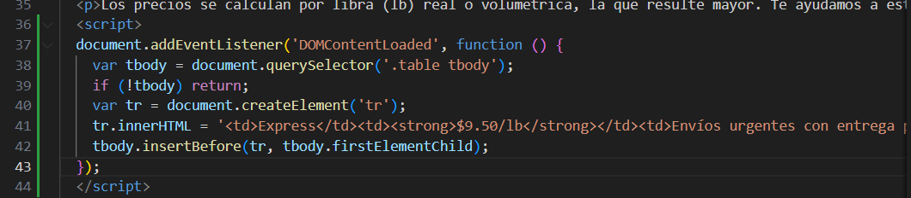

# Evidencia Copilot – chester-01-insercion-express

**Archivo/líneas:** tarifas.html (aprox. donde se insertó la lógica de la fila)

**Prompt/comentario usado:** “Copilot: agrega una nueva fila de ejemplo en la tabla con modalidad Express y una tarifa estimada”

**Qué sugerencia acepté:** Un bloque de JavaScript que inserta dinámicamente una fila con datos de la modalidad “Express” al cargar la página.

**Por qué fue útil:** Automatiza la creación de filas y evita escribir manualmente la estructura HTML, ahorrando tiempo y manteniendo consistencia en los datos.

**Commit relacionado:** (este lo agregaremos después de hacer commit del archivo .md)

